# Architecture

## The full cycle

```mermaid
sequenceDiagram
    participant A as Alice
    participant X as XRP Ledger
    participant F as HeirloomVault<br/>(Flare / Coston2)
    participant D as FDC
    participant T as TEE extension<br/>(FCC)
    participant O as FTSO

    Note over A,F: Setup — while alive
    A->>F: createVault(xrplAccountHash, interval, guardians, willCommitment)
    F-->>A: vaultId + unique XRPL destination tag
    A->>F: sealWill(encryptedWill)
    F->>T: HEIRLOOM / SEAL
    T->>T: decrypt, parse, recompute commitment
    T-->>F: signed attestation (beneficiary count only)
    F->>F: willAttested = true

    Note over A,X: Living — every interval
    A->>X: dust Payment → beacon, DestinationTag = vault tag
    X-->>D: attested
    D-->>F: proveLife(XRPPayment 0x08)
    F->>F: lastHeartbeat = ledger timestamp

    Note over A,F: Silence
    A--xX: no heartbeat for a full interval
    D-->>F: claimDormancy(XRPPaymentNonexistence 0x09)
    F->>F: state = Dormant, grace window opens

    rect rgb(30,45,35)
    Note over A,F: Any heartbeat here cancels everything
    A->>X: late heartbeat
    D-->>F: proveLife → state = Active, approvals cleared
    end

    Note over F,T: Execution — grace elapsed + guardians confirmed
    F->>O: read XRP/USD
    F->>T: HEIRLOOM / EXECUTE (encrypted will, price, estate size)
    T->>T: decrypt, price, allocate, sign XRPL payments
    T-->>F: settleEstate(signed distribution)
    F->>O: re-read XRP/USD, check tolerance
    F->>F: verify TEE signature + commitment → Settled
    T->>X: broadcast signed Payments to beneficiaries
```



## Vault states

```
None ──create──> Active ──dormancy proven──> Dormant ──grace + guardians──> Executing ──TEE result──> Settled
                    ^                            │
                    └────proveLife / revoke──────┘
```

`Active → Dormant` is the only transition anyone other than the owner can drive, and it is fully reversible. Everything downstream of it requires time to pass *and* guardians to confirm.

## The heartbeat channel

Every vault gets a destination tag allocated from `TAG_BASE = 700_000_000`, so vault `n` uses tag `700000000 + n`. All heartbeats go to one shared beacon account, distinguished only by that tag.

This shape is what makes both attestations work on the same channel:

- **Liveness** is a specific transaction: prove it exists, then check its source, tag, amount, and status.
- **Dormancy** is a range query: `XRPPaymentNonexistence` searches by *destination* address and tag, not source. A per-vault tag on a shared beacon is what makes "no heartbeat for this vault" expressible as a single attestation.

Using the holder's own address as the beacon would not work — the nonexistence search cannot filter by sender, so it could not distinguish a heartbeat from any other incoming payment.

## The `heartbeatDrops - 1` bound

`XRPPaymentNonexistence` confirms that no payment delivered **more than** `requestBody.amount` to the target. Heirloom counts a payment as a heartbeat when it delivers **at least** `heartbeatDrops`.

Bridging those two: requesting `amount = heartbeatDrops - 1` means the attestation excludes exactly the payments that would have counted, and nothing less. The contract pins this value rather than trusting whatever the claimant requested — a larger bound would let real heartbeats pass through the search unseen, producing a "proof" of silence for a holder who was signalling all along.

The check is `WrongNonexistenceAmount` in `HeirloomVault.claimDormancy`, and it is covered by the test *"rejects a nonexistence bound that would ignore real heartbeats"*.

## Range scoping

Two conditions make a nonexistence proof mean "the owner missed their heartbeat" rather than merely "there was a quiet stretch somewhere":

| Check | Requirement | Prevents |
|---|---|---|
| `SearchRangeTooLate` | `responseBody.minimalBlockTimestamp <= lastHeartbeat` | A gap between "last known alive" and the start of proven silence, which could skip over a heartbeat that happened |
| `SearchRangeTooShort` | `requestBody.deadlineTimestamp >= lastHeartbeat + interval` | Proving a quiet window shorter than the interval the owner actually agreed to |

## TEE result verification

TEE nodes do not sign the result hash directly. They sign a domain-separated payload:

```
resultHash  = keccak256(keccak256(data) ‖ actionId ‖ keccak256(tag) ‖ status)
payloadHash = keccak256(abi.encode("TEE_ACTION_RESULT", chainId, resultHash))
signature   = ECDSA(EIP-191 personal-sign of payloadHash)
```

This layout must stay byte-identical to `signing.TEEActionResult` in `go-flare-common` — a mismatch recovers the wrong address and every settlement silently reverts. `chainId` stops a Coston2 result being replayed on mainnet; `actionId` binds a signature to exactly one instruction, which is what the *"rejects a signature lifted from a different instruction"* test exercises.

Implemented in `packages/contracts/contracts/lib/TeeActionResult.sol`.

## Three gates on a settlement

`settleEstate` accepts a distribution only when all three hold:

1. **Signature recovers to the registered TEE address.** Proves an attested enclave produced it.
2. **Revealed commitment equals the stored one.** Proves it executed *this* will. An attacker can swap the ciphertext, but not without changing the commitment.
3. **Price within 5% of the live FTSO feed.** Bounds how far a stale or manipulated price could distort a fiat-denominated bequest between request and settlement.

## The allocation engine

Runs inside the enclave; deterministic by design so independent TEE machines executing the same will produce identical output, which is what makes multi-enclave cross-checking possible later.

Order of operations follows how estates actually settle:

1. Reserve the XRPL account reserve (1 XRP) plus one fee per payment.
2. Satisfy fixed bequests — `FIXED_USD` converted at the FTSO price, `FIXED_XRP` as-is.
3. If the estate cannot cover them all, **abate proportionally**: each fixed bequest is scaled by `available / totalWanted`. The alternative — paying in list order until the money runs out — silently rewrites the testator's intent based on an arbitrary ordering.
4. Distribute `SHARE_BPS` bequests over what remains.
5. Sweep the residue, including every drop lost to integer flooring, to the residuary beneficiary.

All arithmetic is integer arithmetic over drops, and `allocate` asserts conservation before returning: `distributed + retained == estate`, exactly. A rounding bug here is a bug that loses someone's inheritance.

## Threat model

| Adversary | Attempt | Defence |
|---|---|---|
| Opportunist | Claim dormancy on a living holder | Needs a real FDC nonexistence proof over a correctly scoped range; the holder cancels with one heartbeat during the grace window |
| Opportunist | Keep a dead holder's vault alive to block execution | `proveLife` requires `sourceAddressHash` to be the estate's own XRPL account |
| Opportunist | Replay an old heartbeat | New heartbeats must be strictly newer than the recorded one |
| Claimant | Request a nonexistence proof with a lax amount bound | Contract pins the bound to `heartbeatDrops - 1` |
| Claimant | Prove silence over a convenient window | Range must cover `[lastHeartbeat, lastHeartbeat + interval]` |
| Colluding guardians | Seize the estate | Guardians can only confirm; they cannot read the will, change terms, or move funds |
| Anyone | Forge a distribution | Must recover to the registered TEE address |
| Anyone | Replay a valid TEE signature onto another instruction or chain | `actionId` and `chainId` are inside the signed payload |
| Anyone | Substitute a different will | Settlement checks the revealed commitment against the sealed one |
| Compromised price source | Skew fiat bequests | Settlement price re-checked against the live FTSO feed within 5% |

The residual trust assumption is the TEE itself — the enclave sees the plaintext will. That is inherent to confidential compute, and it is bounded by attestation: Flare's data providers only accept results from a machine whose code hash is whitelisted on-chain for that extension.
